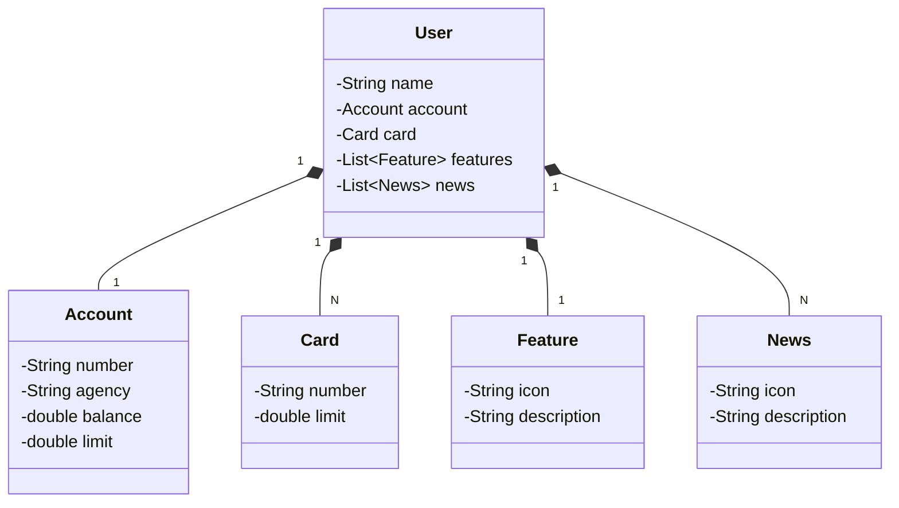

# Santander Dev Week 2023
JAVA RESTFUL API criada para a Santander Dev Week.

## Diagrama de Classes

```mermaid
classDiagram
    class User {
        -String name
        -Account account
        -Card card
        -List~Feature~ features
        -List~News~ news
    }

    class Account {
        -String number
        -String agency
        -double balance
        -double limit
    }

    class Feature {
        -String icon
        -String description
    }

    class Card {
        -String number
        -double limit
    }

    class News {
        -String icon
        -String description
    }

    User "1" *-- "1" Account
    User "1" *-- "N" Card
    User "1" *-- "1" Feature
    User "1" *-- "N" News
```
